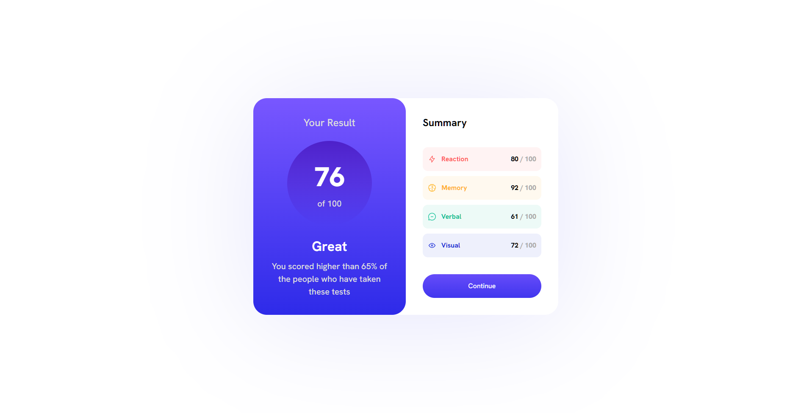
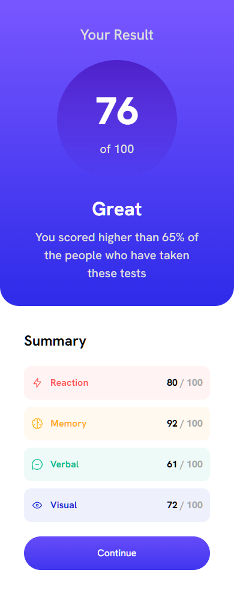

<h1 align="center">Results Summary</h1>
<p align="center">
  Made with <code>HTML</code>, <code>CSS</code>, <code>TypeScript</code>, <code>ReactJS</code>, <code>CSS Modules</code>, <code>SASS</code>
  <br>
  Bootstrapped with <code>Vite</code>
</p>

<p align="center">
  <a href="../../actions"></a>
  <a href="../../commits"></a>
  <a href="./LICENSE"></a>
  
  
</p>

<p align="center">
  <a href="#-screenshots">🖼 Screenshots</a> • 
  <a href="#ℹ%EF%B8%8F-about">ℹ️ About</a> • 
  <a href="#%EF%B8%8F-tools">⚙️ Tools</a> • 
  <a href="#-build-project">🔨 How to Build Project</a> • 
  <a href="#-file-structure">📁 File Structure</a>
</p>

<sup>
  <p align="center">
    <a href="#-npm-packages-worth-mentioning">📦 NPM Packages worth mentioning</a> • 
    <a href="#-details">💡 Details</a> • 
    <a href="#-useful-resources">🔗 Useful resources</a> • 
    <a href="#-author">👤 Author</a>
  </p>
</sup>

## 🖼 Screenshots

<p align="center">
  
</p>

<p align="center">
  
</p>

## ℹ️ About

This is a solution to the challenge "Results Summary" from Frontend Mentor ([link](https://www.frontendmentor.io/challenges/results-summary-component-CE_K6s0maV/hub)).

The challenge is to build out the landing page and get it looking as close to the design as possible.

I made my own Figma prototype and redesigned the whole application.

Figma prototype: https://www.figma.com/file/1EBrHNQkGnjVDeCsr56LnH/Results-Summary?node-id=0%3A1&t=Jega31Fp7n5t5AJq-1

## ⚙️ Tools

- **HTML5**
  - ReactJS
- **CSS**
  - CSS Modules
- **TypeScript**
  - ReactJS
- **NodeJS**
- **Github Pages**

## 🔨 Build project

<table>
  <tr>
    <th>Command</th>
    <th>Description</th>
  </tr>
  <tr>
    <td><code>npm&nbsp;install</code></td>
    <td>First of all install all required packages</td>
  </tr>
  <tr>
    <td><code>npm&nbsp;run&nbsp;dev</code></td>
    <td>Run the app in development mode</td>
  </tr>
  <tr>
    <td><code>npm&nbsp;run&nbsp;build</code></td>
    <td>Build the app</td>
  </tr>
  <tr>
    <td><code>npm&nbsp;run&nbsp;preview</code></td>
    <td>Run the app in production mode</td>
  </tr>
  <tr>
    <td><code>npm&nbsp;run&nbsp;eslint</code></td>
    <td>Check compliance with Eslint rules</td>
  </tr>
</table>

## 📁 File Structure

```Markdown
├── 📁 .github
|   ├── 📁 workflows
|   |   └── 📝 main.yaml      CI/CD instructions for Github Actions
│   └── 📝 dependabot.yml     Instructions for Dependabot
|
├── 📁 docs                   Additional information, documentation 
│   └── 📁 results            Screenshots of how the application works after being fully developed
|
├── 📁 src                    Source files needed for application development
│   ├── 📁 assets             Static assets: images, icons, favicons
│   ├── 📁 components         React components
│   ├── 📁 pages              React page components
│   ├── 📁 utils              Utility functions
│   ├── 📝 App.tsx            App React component
│   ├── 📝 index.css          Tailwind declarations mainly
│   ├── 📝 index.html         Main html file
│   └── 📝 index.tsx          Entry point for the module bundler
|
├── 📝 .eslintrc.json         ESLint configuration file
├── 📝 .gitignore             Instructions for Git about what files to ignore
├── 📝 LICENSE                MIT License. Basically you can do whatever you want with the code
├── 📝 README.md              Project description
├── 📝 package-lock.json      Keeps track of the exact version of every package that is installed
├── 📝 package.json           Various metadata relevant to the project, scripts, dependencies
├── 📝 tsconfig.json          TypeScript configuration file
├── 📝 tsconfig.node.json     TypeScript configuration file for Vite
├── 📝 vite-end.d.ts          Some Typescript stuff for Vite
└── 📝 vite.config.js         Vite configuration file
```

## 📦 NPM Packages worth mentioning

<table>
  <tr>
    <td><code>sass</code></td>
    <td>For styling</td>
  </tr>
</table>

## 💡 Details

Tried out CSS Modules. It's built in Vite

Decided to try a simple project.

## 🔗 Useful resources

-

## 👤 Author

- Frontend Mentor - [@GrbnvAlex](https://www.frontendmentor.io/profile/GrbnvAlex)
- Telegram - [@Arlagonix](https://t.me/Arlagonix)
- Github - [@arlagonix](https://github.com/arlagonix)
